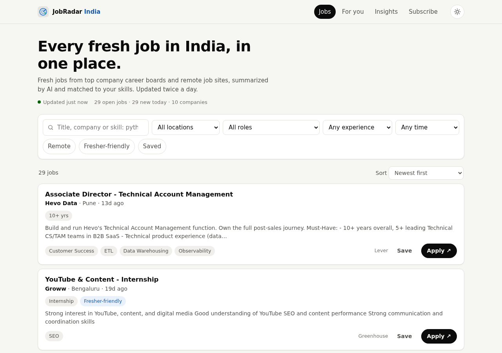
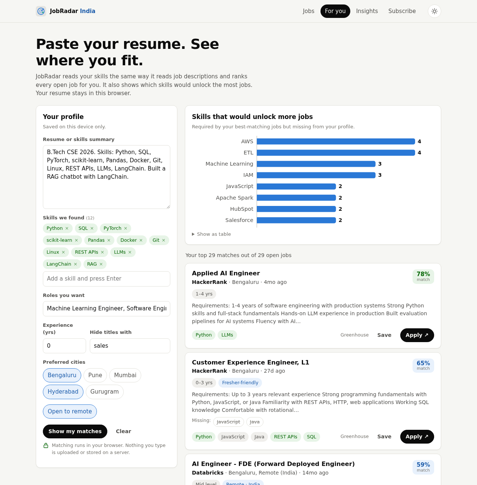
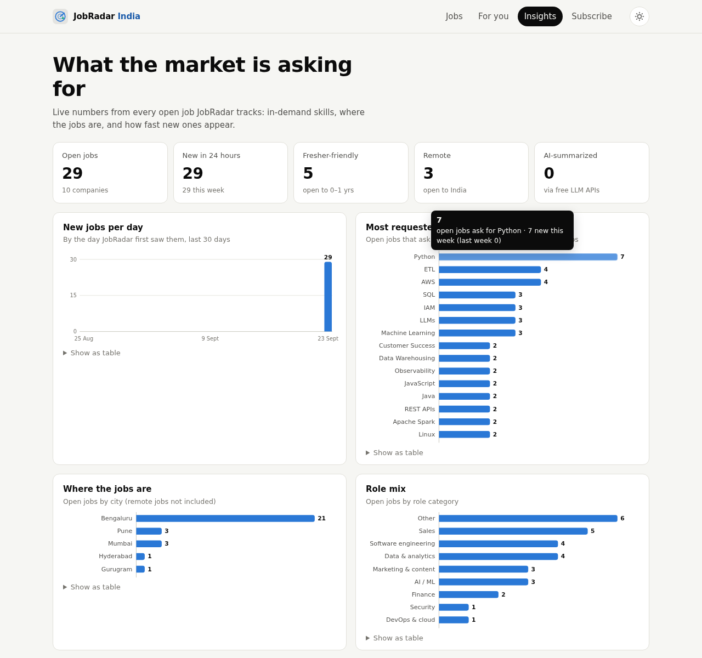
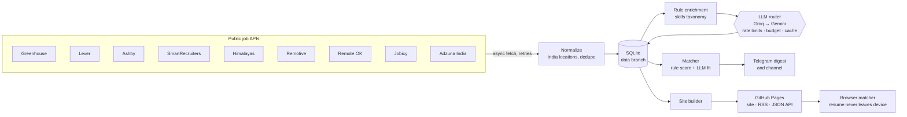

# JobRadar India

**Live site: [dhanushavardhan.github.io/jobradar](https://dhanushavardhan.github.io/jobradar/)**

**An AI-powered job radar that runs itself, for free.** Twice a day it collects fresh jobs from the official career boards of top companies and from remote-job sites, uses free LLM APIs to understand each posting, matches them to your resume, sends you a Telegram digest, and publishes a public website where anyone can search jobs and match their own resume privately in the browser.

[](https://github.com/DhanushaVardhan/jobradar/actions/workflows/ci.yml)
[](https://github.com/DhanushaVardhan/jobradar/actions/workflows/pipeline.yml)


| Search every open job | Paste a resume, get ranked matches | Live market insights |
|---|---|---|
|  |  |  |

<sub>Screenshots are from the offline demo dataset (`tests/fixtures`). After your first live run, the site shows every current job.</sub>

---

## Why this exists

Job hunting in India means checking a dozen career pages and aggregators every day, reading long descriptions to find out whether freshers can even apply, and guessing which skills matter. JobRadar does that work automatically:

- **For you:** a morning Telegram message with the best new matches for *your* resume, each with an AI fit score, the skills you're missing, and one tip on what to highlight.
- **For everyone else:** a fast public site with filters (city, role, experience, fresher-friendly, remote), in-browser resume matching (nothing is uploaded), skill-gap advice ("learning Kubernetes would unlock 14 of your top 50 matches"), RSS feeds per skill and city, a Telegram channel, and an open JSON API.

## What it does

| Stage | How |
|---|---|
| **Collect** | Async connectors for the **public job-board APIs** companies use for their own careers pages (Greenhouse, Lever, Ashby, SmartRecruiters), plus Himalayas, Remotive, Remote OK, Jobicy and Adzuna India. Polite HTTP: global and per-host concurrency limits, retries with backoff, `Retry-After` support. |
| **Clean** | India-aware location parser (Bangalore → Bengaluru, Gurgaon → Gurugram, "Remote – India", states, 25+ cities). Cross-source de-duplication by fingerprint, preferring the company's own board. Jobs are closed when they disappear from a board. |
| **Understand** | A **free LLM** (Groq `gpt-oss-20b` / Qwen, Gemini as backup) reads 5 postings per request and returns a summary, must-have vs nice-to-have skills, years of experience, seniority, fresher-friendliness, work mode and salary. Output is validated field-by-field against a 165-skill taxonomy. A **rule-based extractor** covers every job instantly and takes over when the free quota runs out. |
| **Match** | A transparent 0–100 score (skills 45%, title 25%, experience 15%, location 10%, recency 5%, plus a seniority gate). The same algorithm runs in Python and in the browser (a parity test keeps them identical). For the owner, the top 20 candidates are re-ranked by a larger LLM against the full resume. |
| **Deliver** | Static website on GitHub Pages, RSS feeds, Telegram digest, public Telegram channel, health alerts when a source breaks. |
| **Operate** | GitHub Actions cron (08:00 and 18:00 IST), SQLite state persisted to a `data` branch, Markdown run report in every workflow summary, CI with lint, 60+ tests and an offline end-to-end run. |

## Architecture



More detail and the design decisions are in [docs/ARCHITECTURE.md](docs/ARCHITECTURE.md).

## Why it costs ₹0

| Resource | Free allowance | JobRadar's use |
|---|---|---|
| GitHub Actions | Unlimited minutes on **public** repos | 2 runs/day, ~5–15 min each |
| GitHub Pages | Free static hosting | Site, feeds, JSON (~1–3 MB) |
| Groq API | ~1,000 requests/day **per model**, 30/min, no card | ~60–150 requests/day across 3 models |
| Gemini API | Free tier (backup only) | Used only if Groq is exhausted |
| Telegram Bot API | Free | A few messages/day |
| Job APIs | Public, no key (Adzuna: free key) | ~30–60 requests/run |

The LLM cost is tied to the number of **new jobs**, not to the number of **users**. Each posting is enriched once, and visitor matching runs in their own browser, so 10 or 10,000 visitors cost the same.

---

## Try it in 1 minute (no keys, no network)

```bash
git clone https://github.com/DhanushaVardhan/jobradar && cd jobradar
python -m venv .venv && source .venv/bin/activate      # Windows: .venv\Scripts\activate
pip install -e ".[dev]"
python -m jobradar run --offline tests/fixtures --no-notify
python -m http.server -d site_dist 8000                 # open http://localhost:8000
```

## Deploy your own (about 15 minutes)

1. **Create a public GitHub repo** named `jobradar` (public means unlimited Actions minutes; don't add a README), then push this folder:
   ```bash
   git init -b main && git add . && git commit -m "Initial commit"
   git remote add origin https://github.com/<you>/jobradar.git
   git push -u origin main
   ```
2. **Enable Pages:** *Settings → Pages → Build and deployment → Source: **GitHub Actions***.
3. **Get the free keys:**
   - **Groq:** sign up at [console.groq.com](https://console.groq.com) → *API Keys* → create. No card needed.
   - *(optional)* **Gemini:** [aistudio.google.com](https://aistudio.google.com/apikey) → *Get API key*.
   - *(optional)* **Telegram:** message [@BotFather](https://t.me/BotFather) → `/newbot` → copy the token. Send any message to your new bot, then run `TELEGRAM_BOT_TOKEN=... python -m jobradar telegram` to print your chat id. For a public channel, create a channel, add the bot as an admin, and use `@yourchannel` as the id.
   - *(optional)* **Adzuna India:** [developer.adzuna.com](https://developer.adzuna.com) → free app id and key.
4. **Add repository secrets** (*Settings → Secrets and variables → Actions → New repository secret*):

   | Secret | Required | Value |
   |---|---|---|
   | `GROQ_API_KEY` | recommended | Groq key |
   | `GEMINI_API_KEY` | optional | Gemini key (backup LLM) |
   | `TELEGRAM_BOT_TOKEN` | optional | from BotFather |
   | `TELEGRAM_CHAT_ID` | optional | your chat id (personal digest) |
   | `TELEGRAM_CHANNEL_ID` | optional | `@yourchannel` (public posts) |
   | `ADZUNA_APP_ID` / `ADZUNA_APP_KEY` | optional | Adzuna credentials |
   | `JOBRADAR_PROFILE` | optional | your whole profile YAML (see [`config/profile.example.yaml`](config/profile.example.yaml)) |

5. Edit `config/settings.yaml` → `site.url`, `site.repo_url` and `http.user_agent` with your username.
6. **Run it:** *Actions → JobRadar pipeline → Run workflow* (choose `digest: force` the first time). About 10 minutes later your site is live at `https://<you>.github.io/<repo>/` and the digest is in Telegram. After that it runs itself twice a day.

> Your resume lives only in the `JOBRADAR_PROFILE` secret. It is never written to the repo, the database, or the website.

## Configuration

| File | What it controls |
|---|---|
| [`config/companies.yaml`](config/companies.yaml) | Company boards to track. Add one with `python -m jobradar discover <slug>`, which tries every ATS and prints the line to paste. |
| [`config/settings.yaml`](config/settings.yaml) | Filters (India, remote scopes), retention, sources, LLM providers, models and budgets, matching thresholds, Telegram behaviour, feeds. |
| [`config/skills.yaml`](config/skills.yaml) | Skills taxonomy with aliases and regex rules. The site uses the same file, so browser and pipeline parse text identically. |
| `JOBRADAR_PROFILE` / `profile.yaml` | Your private profile: target roles, years, cities, skills, excluded words, resume text. |

## CLI

```text
python -m jobradar run         # full pipeline   [--no-llm] [--no-notify] [--digest|--no-digest] [--offline DIR]
python -m jobradar doctor      # check secrets, profile, taxonomy and every company board
python -m jobradar discover razorpay swiggy    # find which ATS a company uses
python -m jobradar telegram    # list chat ids that messaged your bot   [--send CHAT_ID]
python -m jobradar site        # rebuild the website from the database
python -m jobradar stats       # database size and recent runs
```

## Tests

```bash
pytest -q          # 60+ tests: parsers, store, LLM router (429s, failover, budgets, cache),
                   # enrichment, matching, Telegram, end-to-end pipeline, Python/JS parity
ruff check src tests && ruff format --check src tests
```

Every external service is simulated with `httpx.MockTransport` (recorded job-board responses, a fake OpenAI-compatible LLM, a fake Telegram API), so the suite runs offline in a few seconds.

## Responsible data use

- Only **official public JSON APIs** are used, no HTML scraping. Requests are rate-limited and identify themselves with a User-Agent.
- Every job links to the **original posting**. Aggregator jobs are credited ("via Himalayas", "via Remote OK", "via Remotive"), as their terms require.
- Remotive is called at most twice a day, as they ask. JobRadar does not re-submit listings to other aggregators or search engines.
- Visitor resumes are processed **only in the browser**. The site has no backend, cookies or analytics.

## Roadmap

- [ ] Hacker News "Who is hiring?" parser (LLM turns free-text comments into structured jobs)
- [ ] Per-user Telegram alerts via a serverless webhook (Cloudflare Workers + D1 free tier)
- [ ] Salary insights by role and city
- [ ] Embedding-based semantic matching in the browser (transformers.js)

## License

MIT. See [LICENSE](LICENSE).
